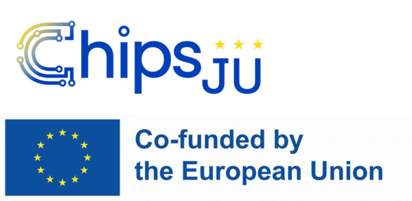

```@meta
CurrentModule = MirrorCalibration
```

# MirrorCalibration

Documentation for [MirrorCalibration](https://github.com/JuliaPhase/MirrorCalibration.jl).

```@index
```

```@autodocs
Modules = [MirrorCalibration]
```

## Funding

This work is part of the 14AMI project (grant agreement No 101111948). The project is supported by the Chips Joint Undertaking and its members including the top-up funding by RVO (The Netherlands Enterprise Agency).

```@raw html

```
